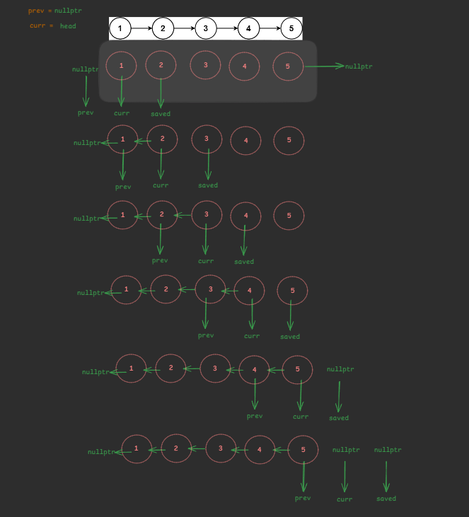

```cpp
ListNode* reverseList(ListNode* head) {
        ListNode* prev = nullptr;
        ListNode* curr = head;                  // traversal pointer


        while(curr != nullptr){
            ListNode* saved = curr->next;       // save the next node
                                                /*Temporarily stores the rest of the original list so it isn't lost when you flip the arrow.*/

            curr->next = prev;                  // point current node to previous node

            prev = curr;                        // move prev pointer forward
            curr = saved;                       // move curr pointer forward
        }
        return prev;                            // Return new head (last node becomes first)

    }
```


